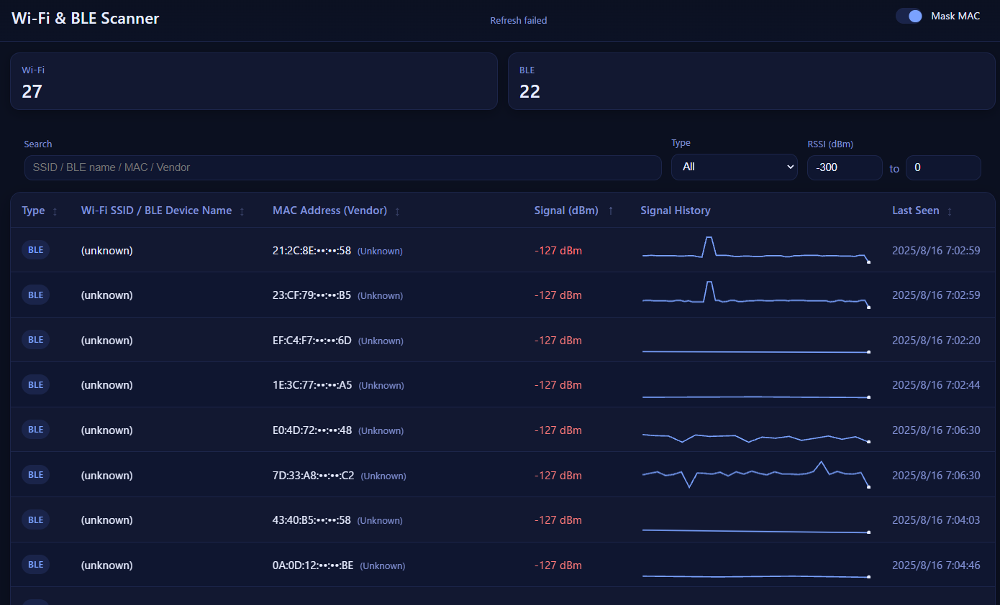

# Wi-Fi & BLE Live Scanner (Flask + pywifi + bleak)




This project is a **real-time Wi-Fi and BLE device scanner** built with:

- **[pywifi](https://github.com/awkman/pywifi)** for Wi-Fi scanning  
- **[bleak](https://github.com/hbldh/bleak)** for Bluetooth Low Energy scanning  
- **[Flask](https://flask.palletsprojects.com/)** for serving a live-updating web UI  
- **Vanilla JavaScript + Canvas** for inline mini sparklines of RSSI history  

It scans **Wi-Fi first**, then **BLE**, and displays results in a table with:

- Device type (Wi-Fi / BLE)  
- Device name (SSID or BLE local name)  
- MAC address + vendor lookup  
- Current signal strength (in dBm)  
- **Signal history chart** for each device  
- Last seen timestamp  

---

## Features
- Works with Windows (confirm with Win11)
- Continuous background scanning of **Wi-Fi networks** and **BLE devices**
- **Vendor lookup** using MAC OUI database (optional)
- Maintains **RSSI history** for each device
- Live updates via AJAX polling
- Mini sparklines drawn with Canvas
- Wi-Fi entries always listed **before** BLE entries
- Sort by signal strength within each type

---

## Requirements
Python 3.8+

Install dependencies:

```bash
pip install -U flask bleak pywifi mac-vendor-lookup
```

---

## Running the App

```bash
python app.py
```

Then open [http://localhost:5000](http://localhost:5000) in your browser.

---

## How It Works

- **Wi-Fi scanner** uses `pywifi` to query available networks every 5 seconds.
  - Signal values are converted to approximate dBm if given in 0–100 quality.
- **BLE scanner** uses `bleak` for continuous scanning, processing advertisement packets.
- Both update a shared `DeviceStore` that keeps:
  - Current RSSI
  - Vendor info
  - RSSI history (last 60 samples)
  - Last seen timestamp
- Flask’s `/api/devices` endpoint serves the current device list in JSON.
- The frontend polls every 2 seconds and redraws the table + sparklines.

---


## Notes

- **Windows BLE**: Ensure Bluetooth is enabled and drivers are installed.
- **Linux BLE**: Requires `bluez` and permissions to use Bluetooth.
- **macOS Wi-Fi**: `pywifi` support is limited; you may need a platform-specific scanner.
- Wi-Fi/BLE scanning may require **admin/root privileges** on some systems.
- The `db\Bluetooth-Company-Identifiers.csv` is coming from https://gist.githubusercontent.com/angorb/f92f76108b98bb0d81c74f60671e9c67/raw/3557638ff1aef908a10a139e3cdfe605a62a2786/Bluetooth-Company-Identifiers.csv
---

## License

MIT
